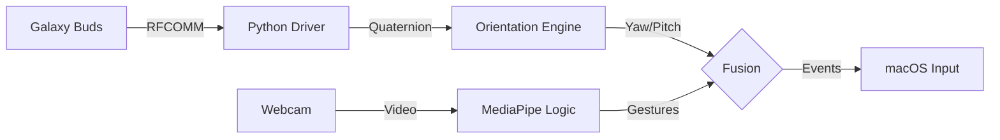

# Galaxy Buds 4D Spatial Head Tracking (Reverse Engineered)


This project reverse-engineers the proprietary Bluetooth RFCOMM protocol of **Samsung Galaxy Buds (Pro/2/3)** to access their internal **6-DoF IMU sensor data** in real-time. It transforms your earbuds into high-fidelity head trackers for 3D visualization or hands-free HCI control.

> 📚 **Documentation**:
> - [Technical Report](TECHNICAL_REPORT.md): Reverse engineering process, protocol structure, and system architecture.
> - [Methodology](METHODOLOGY.md): Academic formalization, mathematical modeling (quaternions), and fusion algorithms.

---

## 🚀 Features

-   **Real-time Head Tracking**: Extracts Quaternion orientation data at ~100Hz.
-   **No Official App Required**: Works directly via native macOS Bluetooth stack (`IOBluetooth`).
-   **Academic Visualization**: Clean, scientific 3D gimbal visualization with Euler angles ($\phi, \theta, \psi$) and webcam overlay.
-   **Multimodal Mouse Control**:
    -   **Point**: Move cursor with head rotation (Yaw/Pitch).
    -   **Click**: Use hand gestures via Webcam (MediaPipe).
        -   👌 **Pinch** (Thumb+Index) = Left Click
        -   🖕 **Middle Pinch** (Thumb+Middle) = Right Click
        -   ✊ **Fist** = Drag & Drop

## 📦 Requirements

-   **Hardware**: Samsung Galaxy Buds Pro, Buds2, Buds2 Pro, Buds FE, or Buds3 Pro.
-   **Software**: Python 3.9+.

## 🛠 Installation

1.  **Clone the repository**:
    ```bash
    git clone https://github.com/fiqgant/galaxy-buds-head-tracking.git
    cd galaxy-buds-head-tracking
    ```

2.  **Install dependencies**:
    ```bash
    pip install -r requirements.txt
    ```

3.  **Connect Buds**: Pair your Galaxy Buds to your computer via Bluetooth.

## 🖥️ Usage

Run the main entry point:

```bash
python main.py
```

The tool will auto-detect your connected Buds. Select a mode from the menu:

1.  **Terminal Mode**: Raw data stream (Quaternions + Euler angles).
2.  **Visualization Mode**: 3D Gimbal plot with orientation dashboard and webcam feed.
3.  **Mouse Control**: Hands-free interactions. 
    -   *Calibration*: Look at the center of the screen and press Enter to zero the sensor.
4.  **Data Logging (CSV)**: Record sensor data (Timestamp, Euler, Quaternion) to CSV file for analysis.

## 🧠 System Architecture



## 🤝 Contributing

Contributions are welcome! Please open an issue to discuss proposed changes or submit a PR.

## 📄 License

This project is open-source under the [MIT License](LICENSE).

---

**Disclaimer**: This is an independent project and is not affiliated with Samsung Electronics. Galaxy Buds are trademarks of Samsung Electronics Co., Ltd.
