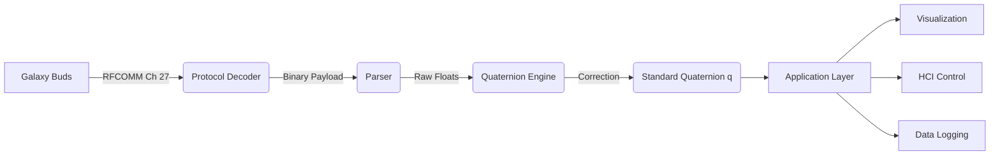

# Technical Report: Galaxy Buds Spatial Sensor Reverse Engineering

## Abstract

This document details the reverse engineering, protocol analysis, and mathematical modeling of the spatial head tracking sensor embedded in Samsung Galaxy Buds Pro/2/3 series. By intercepting and decoding the proprietary Bluetooth RFCOMM communication, we successfully reconstruct real-time 3D head orientation (quaternions). This research facilitates the use of Galaxy Buds as a generic Inertial Measurement Unit (IMU) for various Human-Computer Interaction (HCI) applications.

---

## 1. System Architecture

The core system acts as a middleware that bridges the proprietary Galaxy Buds protocol to a standard orientation data stream.

### Architecture Diagram



---

## 2. Reverse Engineering Methodology

The proprietary communication protocol was deciphered using a combination of **Traffic Analysis** and **Differential Analysis**.

### 2.1 Bluetooth Traffic Sniffing
The initial step involved capturing raw Bluetooth traffic:
1.  **HCI Snoop Log**: Enabling "Bluetooth HCI snoop log" on an Android device.
2.  **Scenario Reproduction**: Toggling "Head Tracking" in the Galaxy Wearable app.
3.  **Wireshark Analysis**: Inspecting `BTHCI_ACL` packets revealed a dedicated RFCOMM channel (typically Channel 27) transmitting high-frequency data upon activation.

### 2.2 Protocol Identification
Key identifiers found during analysis:
-   **Service UUID**: `00001101-0000-1000-8000-00805F9B34FB` (Serial Port Profile).
-   **Data Rate**: Constant stream approx 100Hz when active.
-   **Handshake**: A specific sequence is required to wake the sensor.

### 2.3 Payload Structure Analysis
Through pattern recognition of the binary stream:

```
[SOM] [Length] [MsgID] [PAYLOAD...] [CRC]
 0xFD   L L_h    0x01   D0...D15     C0 C1
```

-   **Header**: `0xFD` acts as the start delimiter.
-   **Message ID 0x01**: Identified as Spatial Audio Data.
-   **Payload**: 16 bytes. Changing device orientation affected these bytes directly.
-   **Data Format**: Differential analysis showed 4 groups of 4 bytes, corresponding to IEEE 754 floats (Little Endian).

---

## 3. Sensor Data Processing

### 3.1 Quaternion Decoding
The 16-byte payload decodes into a Quaternion vector $q = (w, x, y, z)$.

-   Bytes 0-3: $w$ (Scalar)
-   Bytes 4-7: $x$ (Vector i)
-   Bytes 8-11: $y$ (Vector j)
-   Bytes 12-15: $z$ (Vector k)

### 3.2 Coordinate System Transformation
The raw sensor data uses a different coordinate frame than standard 3D engines. A coordinate transformation is applied to aligning the sensor's local frame with a standard World Frame (ENU - East North Up).

$$ q_{standard} = T \cdot q_{raw} $$

## 5. Implementation Analysis

This section deconstructs the Python codebase, analyzing the specific algorithms and mathematical operations implemented.

### 5.1 Data Integrity (`buds/crc.py`)

To detect transmission errors, the protocol uses **CRC-16-CCITT** (False/XMODEM).

**Algorithm Implementation:**
Given a message polynomial $M(x)$ and generator $G(x) = x^{16} + x^{12} + x^5 + 1$:
1.  Initialize register to `0x0000`.
2.  For each byte $B$ in payload:
    $$ \text{reg} = (\text{reg} \ll 8) \oplus B $$
    $$ \forall i \in \{0..7\}: \text{if } (\text{reg} \& 0x8000) \neq 0 \implies \text{reg} = (\text{reg} \ll 1) \oplus 0x1021 \quad \text{else} \implies \text{reg} = (\text{reg} \ll 1) $$
3.  The final 16-bit register value is the checksum.

Code logic:
```python
def crc16_ccitt(data: bytes) -> int:
    poly = 0x1021
    reg = 0x0000
    for byte in data:
        reg ^= (byte << 8) & 0xFFFF
        for _ in range(8):
            if reg & 0x8000:
                reg = ((reg << 1) ^ poly) & 0xFFFF
            else:
                reg = (reg << 1) & 0xFFFF
    return reg
```

### 5.2 Protocol Parsing (`buds/message.py`)
Handles binary structures. The parsing logic scans for `0xFD` SOM delimiter.

**Length Decoding:**
The length field (2 bytes, Little Endian) encodes payload size in the lower 10 bits:
$$ \text{Length}_{payload} = (\text{Byte}_2 | (\text{Byte}_3 \ll 8)) \& 0x3FF $$
Bits 10-15 are reserved status flags.

### 5.3 Math Engine: Quaternion to Euler (`buds/quaternion.py`)

The raw unit quaternion $q = [w, x, y, z]$ is converted to Euler angles (Roll $\phi$, Pitch $\theta$, Yaw $\psi$) using the standard Z-Y-X Tait-Bryan conversion:

1.  **Yaw ($\psi$) - Z-axis:**
    $$ t_0 = 2.0 \cdot (w \cdot z + x \cdot y) $$
    $$ t_1 = 1.0 - 2.0 \cdot (y^2 + z^2) $$
    $$ \psi = \text{atan2}(t_0, t_1) $$

2.  **Pitch ($\theta$) - Y-axis:**
    $$ t_2 = 2.0 \cdot (w \cdot y - z \cdot x) $$
    $$ t_2 = \max(-1.0, \min(1.0, t_2)) \quad \text{// Clamp to avoid domain error} $$
    $$ \theta = \arcsin(t_2) $$

3.  **Roll ($\phi$) - X-axis:**
    $$ t_3 = 2.0 \cdot (w \cdot x + y \cdot z) $$
    $$ t_4 = 1.0 - 2.0 \cdot (x^2 + y^2) $$
    $$ \phi = \text{atan2}(t_3, t_4) $$

All outputs are in radians, converted to degrees: $\text{deg} = \text{rad} \cdot \frac{180}{\pi}$.

### 5.4 Application Layer (`buds/visualization.py`, `buds/mouse.py`)
Consumes the processed quaternion data.
-   **Visualization**: Uses `matplotlib` to render the 3D gimbal (Euler angles) and overlays it on a webcam feed with aspect-ratio correction.
-   **Fusion Control**: Combines the Head Yaw/Pitch (from `quaternion.py`) with Hand Landmarks (from MediaPipe) to synthesize OS-level mouse events via `Quartz`.

---

## 6. Case Study: Multimodal Interface

As a proof-of-concept for the decoded sensor data, we implemented a hands-free mouse controller.

### 6.1 Head Tracking Cursor Mapping
The spherical orientation maps to linear 2D screen coordinates (`target_x`, `target_y`).

Given:
-   $\Delta\psi = \psi_{current} - \psi_{center}$ (Yaw delta)
-   $\Delta\theta = \theta_{current} - \theta_{center}$ (Pitch delta)
-   $S$: Sensitivity factor (e.g., 25.0 pixels/degree)
-   $(W, H)$: Screen dimensions

$$ X = \frac{W}{2} + (\Delta\psi \cdot S) $$
$$ Y = \frac{H}{2} - (\Delta\theta \cdot S) $$

*Note: Y-axis logic is inverted (Pitch Up = Negative Y in screen space).*

### 6.2 Hand Gesture Recognition (MediaPipe)
To trigger click actions, we use geometric thresholds on 21 hand landmarks.

**Pinch Click:**
$$ D_{pinch} = \sqrt{(x_{thumb} - x_{index})^2 + (y_{thumb} - y_{index})^2} $$
$$ \text{Trigger Click if } D_{pinch} < 0.03 \text{ (normalized scale)} $$

**Fist Detection (Drag):**
Checks if ALL fingertips are closed (distance to wrist < knuckle to wrist).
$$ \forall f \in \{Index, Middle, Ring, Pinky\}: \|P_{tip_f} - P_{wrist}\| < \|P_{mcp_f} - P_{wrist}\| $$

---

## 7. Conclusion

This project successfully demonstrates the capability to reverse-engineer closed hardware ecosystems (Galaxy Buds) and repurpose them as high-fidelity input devices. converting a consumer audio product into a precise 6-DoF IMU controller.
